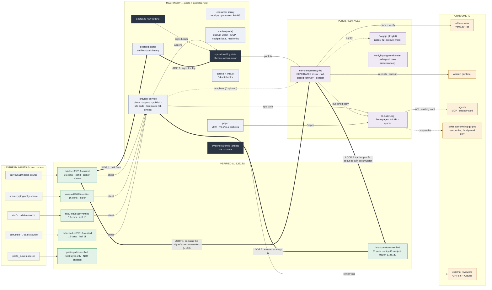

# The estate map

One page holding the entire mental model of the Lean Transparency Log
endeavour: every repository, service, mirror, and operator-held entity,
and — most importantly — the *typed* relationships between them,
including the two self-referential loops that make the estate hard to
keep in one head. Maintained here in pacta because pacta is the
machinery hub and the only repo that changes freely.

State snapshot (2026-07-19): log **13 leaves**, root `3488a2d0…`, key
fingerprint `874c8a00…`, paper **v0.9 camera-ready (23 pp)**, five
attested components, pacta suite 118 green.

## The two loops (read these first)

**Loop 1 — the dogfood signer.** The log's tree heads are signed by
`verified-dalek-serial`, a binary built from `dalek-ed25519-verified` —
whose own attestation is leaf 8 *inside the log it signs*. Before
signing, the provider re-checks inclusion of the signer's leaf. The
signature vouches for the tree; the tree contains the proofs of the
signer's source. (Execution provenance is reported, not proven — the
paper says so explicitly.)

**Loop 2 — the self-attestation.** `ltl-accumulator-verified` is a Lean
corpus proving soundness of the log's own accumulator *model*
(extractors, consistency binding, per-step pin safety). It was attested
into the log as **entry 13** — the log carries kernel-checked proofs
about its own machinery, scoped honestly (recursive model, not the
deployed verifier; see the corpus KNOWN-GAPS ledger).

## Repository inventory

| Repository | Lane | Role | Mutability |
|---|---|---|---|
| `curve25519-dalek-source`, `anza-cryptography-source`, `risc0-…-source`, `betrusted-…-source`, `pasta_curves-source` (+ `xous-core`, `litex-boards` context) | upstream | pinned inputs to extraction | **frozen — never modified** |
| `dalek-` / `anza-` / `risc0-` / `betrusted-ed25519-verified` | subject | Rust source + Lean proofs; 16 certs each; attested (leaves 8–11, generations at 0–7) | frozen at attested commits; branch moves only for docs |
| `pasta-pallas-verified` | subject | field layer proven; curve layer pending; **not attested** | changes freely |
| `ltl-accumulator-verified` | subject | 61-cert corpus about the log's accumulator model; **entry-13 subject**, frozen `172a1d0` | frozen; doc-only commits allowed |
| `proof-aware-crypto-tooling-agent` (this repo) | machinery | provider service, consumer library, warden (+ local read-only cockpit), dogfood signer, paper, course, tests | **changes freely — the hub** |
| `lean-transparency-log` | published | the public mirror: leaves, heads, receipts, fail-closed `verify.py` + selftest | **generated by publish** — canonical files here, templates in pacta, CI-pinned |
| `verifying-crypto-with-lean` | published | undergraduate book; zero coupling to log state | changes freely |
| `swisspost-evoting-go-poc` | consumer | operator's PoC; prospective consumer (family-level dalek match only) | independent |

## Services, infra, operator-held

| Entity | What it is |
|---|---|
| **ltl.zkdefi.org** | droplet (caddy → docker `cloud-ltl-1`): homepage rendered from live leaves, `/v1` API, `/paper` (+`/v0.2`, `/v0.1`), key endpoint. Read-only; no key material on the server. Deployment configuration is maintained privately. |
| **Forgejo** (`cloud-forgejo-1`) | nightly (03:00) mirror of the entire saymrwulf GitHub account — disaster-recovery copy. |
| **Signing key** | offline, operator-only; fingerprint `874c8a00…`; never on the server; public half published in two independent locations. |
| **Operational log state** | `provider/state/transparency-log-main` — the true accumulator. Appends happen here; the mirror is its projection. |
| **Evidence archive (offline)** | review kits and stamped artifacts (`_timestamp_hash8` convention); never in git. |

## Edge glossary

| Edge | Meaning |
|---|---|
| extract | pinned source → Lean model (Aeneas/Charon) |
| attest | subject at pinned commit → provider check → signed leaf |
| append / publish | leaf → operational state → generated mirror |
| templates (CI-pinned) | pacta `published_assets` → mirror's `verify.py`/selftest/README; guarded by `tests/test_published_assets.py` since 2026-07-19 |
| serve | pacta app + mirror copy + paper → droplet → site |
| consume | mirror/site → cloners, warden, agents (receipts recomputed, never trusted) |

## Maintenance

Update this file when: a leaf is appended or a head signed (snapshot
line), the paper version changes, a repo/service/consumer is added or
retired, or a loop-relevant mechanism changes. Rules that keep the map
honest: **generated artifacts are fixed at their source** (mirror files
→ pacta templates); subject repos move only for docs; the three
operator-held entities are never expanded into detail here, and the
private infrastructure layer is deliberately unnamed — this map lists
only entities whose existence is already public or must be public for
trust.
